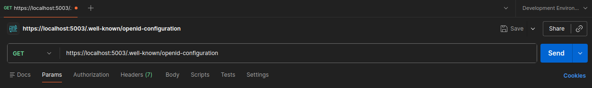
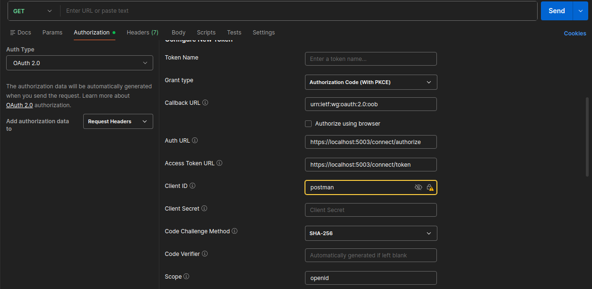

# Play.Identity

Play.Identity é um microserviço escrito em .net 8.0, que fornece suporte para registro, autenticação e autorização de usuários da aplicação Play.

## Ambiente de Desenvolvimento

| TOOL                                                      | DESCRIPTION                                     |
| :-------------------------------------------------------- | :---------------------------------------------- |
| [Ubuntu 24.04.3 LTS](https://ubuntu.com/download/desktop) | Sistema operacional desktop                     |
| [Visual Studio Code](https://aka.ms/vscode)               | IDE para desenvolvimento                        |
| [.Net 8.0 SDK](https://dotnet.microsoft.com/download)     | Kit para desenvolvimento do software            |
| [Docker](https://docs.docker.com/get-started/)            | Serviço provedor de container de infraestrutura |

[Back](#playidentity)


## Objetivos

### Módulo 1

* Entender o ASP.NET Core Identity (membership system)
* Integrar o ASP.NET Core Identity com MongoDB
* Habilitar o registro e login de usuário
* Adicionar REST API endpoints para usuários

### Módulo 2

* Integrar o IdentityServer ao microsserviço de identidade.
* Implementar a autenticação via OpenID Connect.
* Explorar a estrutura do JSON Web Tokens.
* Gerar um token de acesso do usuário para acessar recursos protegidos.
* Generalizar a configuração de segurança de microsserviços.

### Módulo 3

* Como armazenar secrets durante o desenvolvimento local
* Tipos de autorização em ASP.NET Core
* Seed users e roles no identity microservice
* Como implementar segurança baseada em roles
* Como implementar segurança baseada em claims

## Bibliotecas

```powershell
dotnet tool install -g dotnet-aspnet-codegenerator --version 8.0.0

Skipping NuGet package signature verification.
You can invoke the tool using the following command: dotnet-aspnet-codegenerator
Tool 'dotnet-aspnet-codegenerator' (version '8.0.0') was successfully installed.
```

```powershell
dotnet add package Microsoft.VisualStudio.Web.CodeGeneration.Design --version 8.0.0
```

```powershell
dotnet add package Microsoft.AspNetCore.Identity.UI --version 8.0.0
```

```powershell
dotnet add package Microsoft.EntityFrameworkCore.Tools --version 8.0.0
```

```powershell
dotnet aspnet-codegenerator identity --files "Account.Register"
```

## MongoDB Identity

```powershell
dotnet add package AspnetCore.Identity.MongoDbCore
```

## Registrar um Usuário

email: player1@play.com
password: Passw0rd!
```powershell
https://localhost:5003/identity/Account/register
```

## IdentityServer

```powershell
dotnet add package Duende.IdentityServer
```

```powershell
dotnet add package Duende.IdentityServer.AspNetIdentity
```

## Acessando as Configurações do IdentityServer

- Executar o microserviço do identity
- Abrir o Postman e fazer um GET em `https://localhost:5003/.well-known/openid-configuration`



## Gerando Token de Autenticação Postman

- Executar o microserviço do identity
- No Postman criar um novo Get Request, sem o endpoint, configurar authentication conforme a imagem a seguir. 



## Secret Manager

Para inicializar um projeto para usar secrets, usar o seguinte comando: `dotnet user-secrets init` na pasta do projeto.

```powershell
dotnet user-secrets init
Set UserSecretsId to 'c3954db9-a8f1-4861-9069-5432a607531d' for MSBuild project '/home/marcos-cruz/Projects/Play/Play.Identity/src/Play.Identity.Api/Play.Identity.Api.csproj'.
```

### Criar uma secret

Para criar uma secret no ambiente de desenvolvimento, deve-se executar o comando na pasta do projeto sempre obedecendo a estrutura hierarquica definida para o arquivo, por exempolo.

```powershell
dotnet user-secrets set "IdentitySettings:AdminUserPassword" "Passw0rd!"
```